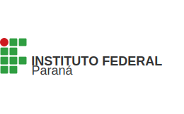

# Olá!

**Desenvolvedor RPA | Analista de Automação e IA**  

*Integração de Inteligência Artificial e LLMs Locais Open Source*

---

### Sobre mim

Sou um profissional focado em criar soluções que otimizam processos e geram valor através da tecnologia. Meu foco atual está na união entre a **Automação (RPA)** e as novas fronteiras da **Inteligência Artificial**.

**O que você encontrará nos meus repositórios:**
- 🤖 **Automação (RPA):** Ferramentas construídas com Python e desenvolvimento de fluxos para ganho de eficiência operacional.
- 🧠 **IA Local & LLMs Open Source:** Testes de LLMs Open Source foco para ambientes corporativos seguros e experimentos avançados com **RAG**.
- 🏗️ **Arquitetura & Processos:** Soluções de arquitetura para processos corporativos, incluindo exemplos de mapeamento **BPMN (AS-IS e TO-BE)**.
- 📊 **Análise de Dados:** Aplicação de dados para suportar a tomada de decisão estratégica.

🚧 *Em construção — novos projetos sendo adicionados continuamente.*
---

### Formação Acadêmica

<table border="0" cellspacing="0" cellpadding="0">
  <tr>
    <td align="center" valign="middle" width="150">
      
    </td>
    <td valign="middle">
      <table border="0" cellspacing="0" cellpadding="16">
        <tr>
          <td>
            <strong>Gestão da Tecnologia da Informação (GTI)</strong> 
            <em>Instituto Federal do Paraná (IFPR)</em> 
            Em andamento
          </td>
        </tr>
      </table>
    </td>
  </tr>
</table>

### Tecnologias e Ferramentas

  
  
  
  
    
  
  
  
  
  

---

### 🏆 Certificações em Destaque

  <!-- Badge 1: Google IT Automation (Link atualizado) -->
  
  &nbsp;&nbsp;&nbsp;&nbsp;&nbsp;&nbsp;
  <!-- Badge 2: Google Data Analytics (Link atualizado) -->
  

 

<i> Clique nos badges para validar a autenticidade </i>

---

### Portfólio
* **[Meus Certificados](https://github.com/sandromntr-dot/Certificados)** - Acesse meu repositório completo de certificados.

---

### 📫 Como me encontrar?
